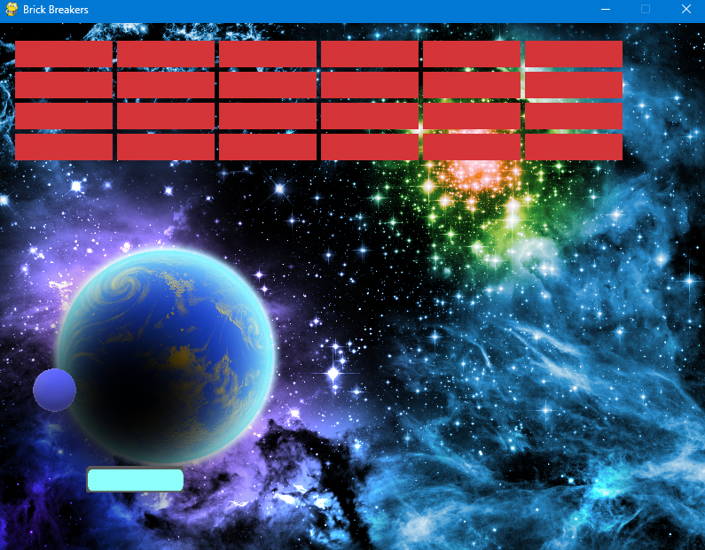

# Brick Breakers

Brick Breakers is a more generic version of the famous Atari breakout game
where you have to break down all the bricks on the top of the screen with
a paddle (as the player) that moves left and right. The game ends when the ball
drops below the screen, so you need to have good reflexes to keep the ball
in play.

# Game Screen Shots

# Installation

- You Need to first install Python (at least version 2.5)
- You then install Pygame via pip, the python package manager.
- To run the program, run: `python main.py` on your terminal, within the root directory and enjoy the game!

# Technologies used

- python (3.11)
- pygame (2.5.2)

# Appreciation

Thank you for taking the time to checkout this project, if you want to collaborate, feel free to check out my work on the portfolio site, linked in my github profile.
